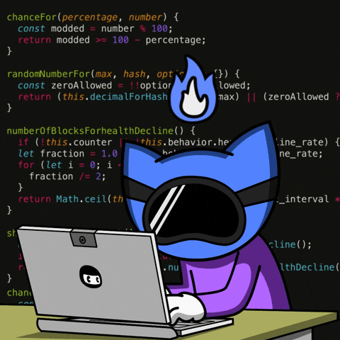

  

<table>
  <tr>
    <td>
      <h1 align="center">Hi , I'm Joaquin Calligaro</h1>
      <ul>
        <li>👨‍💻 Junior Frontend Developer.</li>
        <li>🎓 University Technician in Programming.</li>
        <li>✨ Focused on learning <b>JavaScript</b>, <b>TypeScript</b>, <b>React</b> and modern frontend tools.</li>
        <li>📖 Growing skills through practical experience.</li>
        <li>
          📧 Reach me via Email
          or connect on <a href="https://www.linkedin.com/in/joaquincalligaro/" target="_blank" rel="noopener noreferrer">LinkedIn</a>.
        </li>
        <li>📍 I'm From Argentina.</li>
    </td>
    <td width="230"  height="180" align="center" valign="middle">
      
    </td>
  </tr>
</table>

---

  

---

## <strong>🌐 Connect with Me</strong>

## 💻 Tech Stack 

### 🚀 Frontend

---
### 🗄️ Databases

---

### 🛠️ Tools & Others

---

### 🎨 Design & Creativity

---

### 📊 Design & Creativity

|  |  |
| --------------------------------------------------------------------------------------------------------------------------------------------------------------------------------------- | ------------------------------------------------------------------------------------------------------------------------------------------------------------- |

 

  

